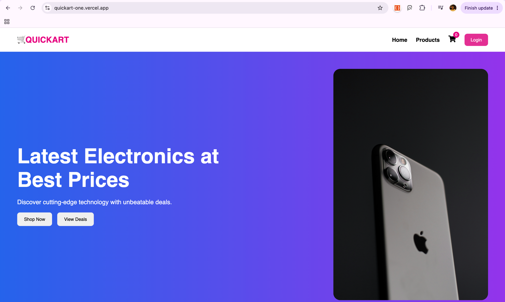
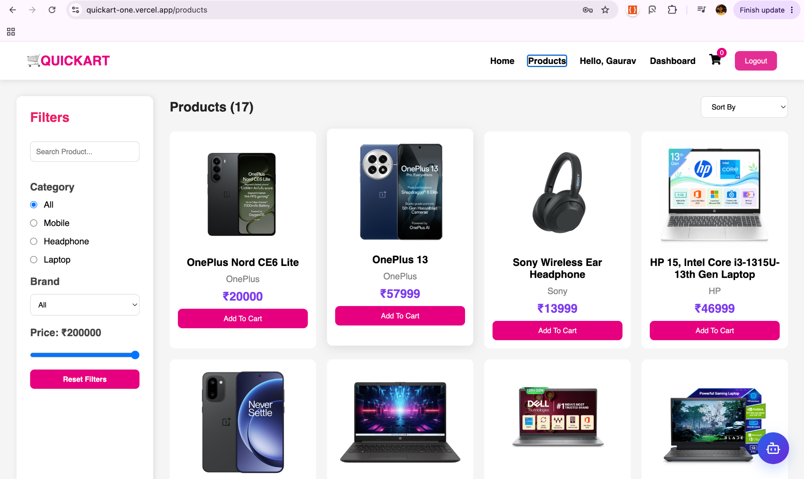
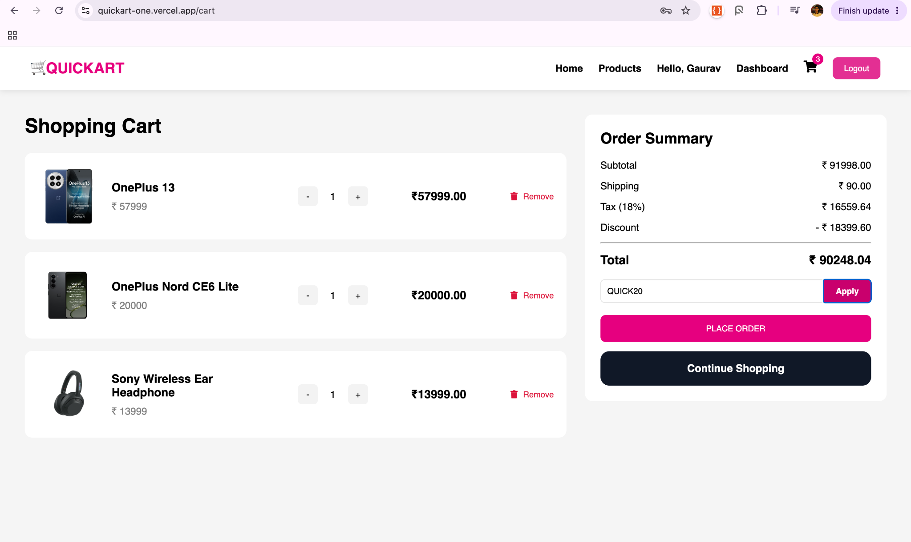
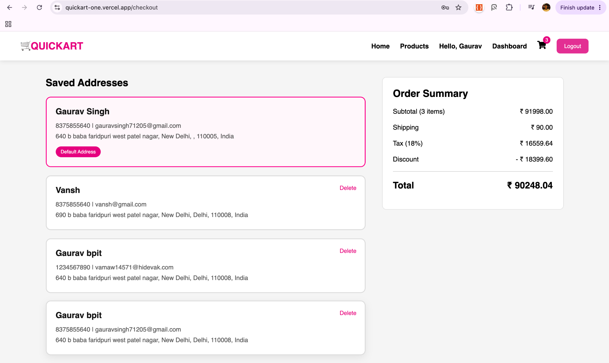
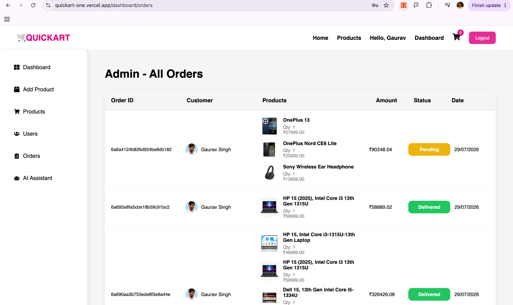
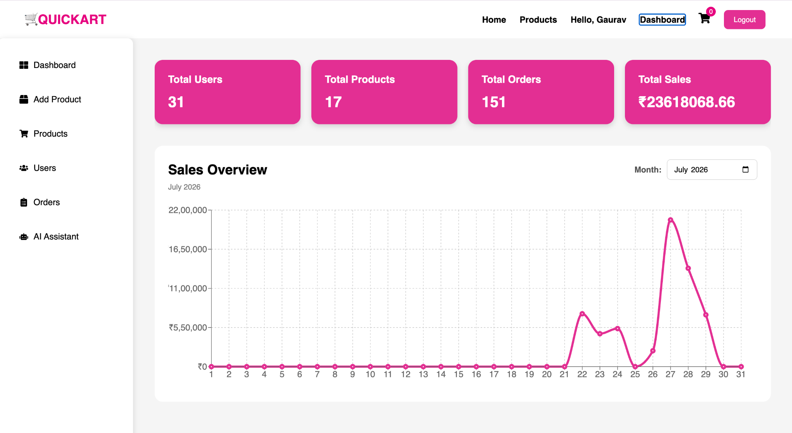
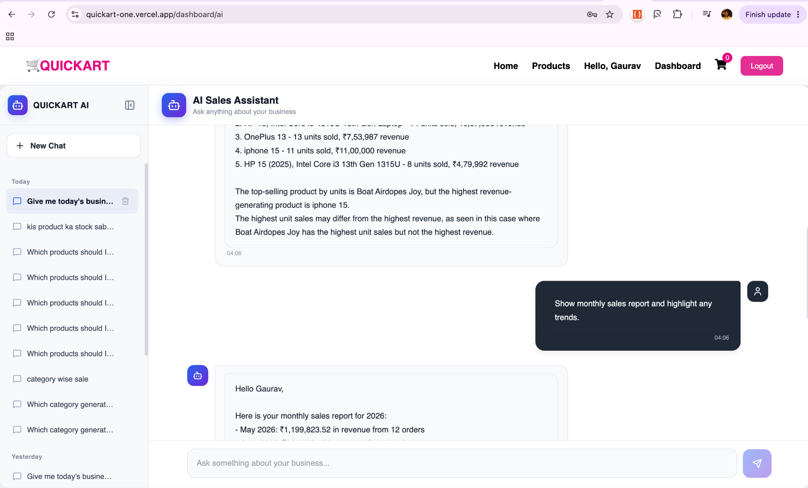

# 🛒 QUICKART – AI Powered MERN E-Commerce Platform

<p align="center">


</p>

QUICKART is a modern **AI-powered Full Stack MERN E-Commerce Platform** that combines a seamless online shopping experience with an intelligent **Admin AI Assistant** capable of analyzing business data, generating actionable insights, monitoring inventory, and assisting store management in real time.

The platform provides secure authentication, Razorpay payment integration, Cloudinary image uploads, MongoDB-powered order management, intelligent inventory tracking, delivery verification, and a responsive admin dashboard.

---

# ✨ Key Highlights

- 🤖 AI Shopping Assistant
- 📊 AI Admin Business Assistant
- 🛍️ Complete MERN E-Commerce Platform
- 🔐 Secure JWT Authentication
- 💳 Razorpay Payment Gateway
- ☁️ Cloudinary Image Uploads
- 📦 Smart Inventory Management
- 📈 Business Analytics Dashboard
- 📧 Automated Email Notifications
- 📱 Fully Responsive UI

---

# 🚀 Features

## 🔐 Authentication & Security

- JWT Authentication
- Secure User Registration & Login
- Protected Routes
- Session Management
- Email Verification
- Re-Verification Support
- Logout Functionality
- Guest Cart Support
- Automatic Cart Merge After Login
- Persistent User Cart
- Multiple Address Management
- Secure Checkout
- Order Confirmation Emails
- Delivery Success Emails

---

## 👤 Customer Features

- Update Profile
- Upload Profile Picture
- Cloudinary Image Storage
- Product Search
- Advanced Filtering
- Product Sorting
- Product Details
- Dynamic Product Gallery
- Add to Cart
- Quantity Management
- Persistent Cart
- Razorpay Checkout
- Order History
- Delivery Verification Code
- Copy Delivery Code
- MongoDB Order Storage

---

## 🛍️ Product Management

- Product Listing
- Add Product
- Edit Product
- Delete Product
- Dynamic Stock Management
- Automatic Stock Reduction
- Out of Stock Detection
- Multiple Product Images
- Category Filtering
- Brand Filtering
- Price Filtering
- Product Sorting

---

# 📦 Order Management

The platform provides a complete order lifecycle management system for both customers and administrators.

### Features

- Store Orders in MongoDB
- Fetch User Order History
- Dynamic Order Status Tracking
- Admin Order Dashboard
- Selected Address Storage
- Delivery Verification Workflow
- Automatic Order Cancellation on Insufficient Stock
- Order Confirmation Emails
- Delivery Success Emails

### Order Workflow

```
Pending
   │
   ▼
Confirmed
   │
   ▼
Packed
   │
   ▼
Shipped
   │
   ▼
Out For Delivery
   │
   ▼
Delivered
```

Supported order states:

- Pending
- Confirmed
- Packed
- Shipped
- Out For Delivery
- Delivered
- Cancelled
- Failed

---

# 💳 Payment System

QUICKART integrates **Razorpay** to provide a secure and seamless payment experience.

### Features

- Razorpay Payment Gateway
- Secure Checkout
- Automatic Order Creation
- Payment Verification
- Cart Clearing after Successful Payment
- Address Selection during Checkout
- Transactional Emails
- Brevo Email Integration

---

# 📊 Admin Dashboard

The Admin Dashboard enables complete store management through an intuitive interface.

### Dashboard Features

- Product Management
- Order Management
- Customer Order Tracking
- Product Image Management
- Dynamic Order Status Updates
- Inventory Management
- Sales Dashboard
- Monthly Analytics
- Revenue Insights
- AI Business Assistant
- Inventory Intelligence
- Delivery Workflow Monitoring

---

# 🤖 AI Shopping Assistant

Customers can interact with an AI-powered shopping assistant that provides personalized product recommendations and shopping guidance.

### Features

- Natural Language Shopping
- Product Recommendations
- Product Comparison
- Budget-Based Suggestions
- Category-Based Recommendations
- Feature-Based Product Search
- Conversational Shopping Experience

### Example Queries

```
Recommend a smartphone under ₹30,000.

Suggest the best wireless earbuds for gym.

Compare OnePlus 13 and iPhone 16.

Which laptop is best for web development?

Show me the best-rated products.
```

---

# 🧠 AI Admin Assistant

QUICKART includes an intelligent **Agentic AI Admin Assistant** powered by **Groq**, capable of understanding natural language queries and performing real-time business analysis.

Unlike traditional chatbots, the assistant intelligently selects the appropriate business tool, retrieves live analytics from MongoDB, and generates contextual insights for administrators.

### Capabilities

- Business Overview
- Monthly Sales Analysis
- Revenue Insights
- Top Selling Products
- Low Stock Detection
- Inventory Intelligence
- AI Business Recommendations
- Natural Language Business Queries
- Real-Time MongoDB Analytics
- Chat History Support
- Multi-Conversation Support
- Interactive Stock Update Cards
- Intelligent Tool Selection
- Agentic AI Workflow

### Example Prompts

```
Give me today's business overview.

Show my top selling products.

Which products need restocking?

Analyze my business performance.

Show monthly sales report.

Suggest ways to increase revenue.
```

---

# 🛠️ Tech Stack

## 🎨 Frontend

- React.js
- React Router DOM
- Context API
- Axios
- React Toastify
- React Icons
- CSS3
- Vite

---

## ⚙️ Backend

- Node.js
- Express.js
- MongoDB
- Mongoose
- JWT Authentication
- Bcrypt.js
- Nodemailer
- Multer
- Groq API

---

## ☁️ Cloud & Services

- MongoDB Atlas
- Cloudinary
- Razorpay
- Render
- Vercel
- Brevo SMTP
- Brevo Transactional Email API

---

# 🧠 AI Architecture

The AI Admin Assistant follows an **Agentic AI Workflow**, where user requests are analyzed, mapped to business tools, and answered using real-time MongoDB analytics.

```
                     Admin Query
                          │
                          ▼
                     Groq Planner
                          │
                          ▼
              Intent Classification
                          │
                          ▼
                 Tool Selection Layer
        ┌──────────┬──────────┬──────────┐
        ▼          ▼          ▼          ▼
 Business     Monthly      Top       Low Stock
 Overview      Sales      Products    Analysis
        │          │          │          │
        └──────────┴──────────┴──────────┘
                          │
                          ▼
                     MongoDB Data
                          │
                          ▼
                 AI Generated Insights
                          │
                          ▼
               Interactive Admin Chat
```

---

# 📁 Project Structure

```
QuickArt
│
├── frontend
│   ├── components
│   ├── pages
│   ├── context
│   ├── services
│   ├── assets
│   └── App.jsx
│
├── backend
│   ├── config
│   ├── controllers
│   ├── middleware
│   ├── models
│   ├── routes
│   ├── services
│   ├── utils
│   └── server.js
│
└── README.md
```

---

# ⚙️ Installation

Clone the repository

```bash
git clone https://github.com/your-username/quickart.git
```

---

## Install Frontend

```bash
cd frontend
npm install
```

---

## Install Backend

```bash
cd ../backend
npm install
```

---

# 🔑 Environment Variables

Create a `.env` file inside the backend directory.

```env
PORT=8000

MONGO_URI=your_mongodb_connection_string

JWT_SECRET=your_jwt_secret

MAIL_USER=your_email
MAIL_PASS=your_email_password

CLOUDINARY_CLOUD_NAME=your_cloud_name
CLOUDINARY_API_KEY=your_api_key
CLOUDINARY_API_SECRET=your_api_secret

RAZORPAY_KEY_ID=your_key
RAZORPAY_SECRET=your_secret

BREVO_API_KEY=your_brevo_api_key

Groq_API_KEY=your_Groq_api_key
```

---

# ▶️ Run the Project

## Start Backend

```bash
npm run dev
```

---

## Start Frontend

```bash
npm run dev
```

The frontend will run on:

```
http://localhost:5173
```

The backend will run on:

```
http://localhost:8000
```

---

# ✨ Advanced Features

### 🛒 Customer Experience

- Guest Shopping Support
- Automatic Cart Merge After Login
- Persistent Shopping Cart
- Multiple Delivery Addresses
- Secure Checkout Flow
- Order Tracking
- Delivery Verification Code
- Email Notifications
- Responsive UI Across Devices

---

### 📦 Inventory Management

- Automatic Stock Deduction
- Dynamic Stock Updates
- Out of Stock Detection
- Low Stock Monitoring
- Interactive Restock Actions
- Real-Time Inventory Insights

---

### 🤖 Artificial Intelligence

- AI Shopping Assistant
- AI Admin Assistant
- Agentic AI Workflow
- Natural Language Query Processing
- Intelligent Tool Selection
- Business Analytics
- Monthly Sales Insights
- Revenue Analysis
- Inventory Intelligence
- Top Selling Product Analysis
- Low Stock Recommendations
- AI Business Suggestions
- Real-Time MongoDB Analytics
- Multi-Chat Support
- Chat History
- Interactive Admin Actions

---

### 🔒 Security

- JWT Authentication
- Protected Routes
- Password Hashing
- Email Verification
- Secure Payment Processing
- Session Management

---

# 🌍 Deployment

| Service | Platform |
|----------|----------|
| Frontend | Vercel |
| Backend | Render |
| Database | MongoDB Atlas |
| AI Model | Groq |
| Image Storage | Cloudinary |
| Payments | Razorpay |

---

# 🔗 Live Demo

### 🛒 Frontend

```
https://quickart-one.vercel.app
```

### ⚙️ Backend API

```
https://quickart-jxc5.onrender.com
```

---

# 📸 Screenshots

> Add screenshots here after deployment.

## 🏠 Home Page

```

```

---

## 🛍️ Product Details

```
 
```

---

## 🛒 Shopping Cart

```
 
```

---

## 💳 Checkout

```
 
```

---

## 📦 Orders

```
 
```

---

## 📊 Admin Dashboard

```
 

```

---

## 🤖 AI Shopping Assistant

```
 
```

---

## 🧠 AI Admin Assistant

```
 
```

---

# 🚀 Future Enhancements

- Voice-Based Shopping Assistant
- AI Product Review Summarization
- Personalized Product Recommendations
- AI Sales Forecasting
- Revenue Prediction
- Smart Inventory Forecasting
- Automated Restock Suggestions
- Customer Behavior Analytics
- PDF Report Generation
- Multi-Vendor Marketplace Support
- Wishlist Sharing
- Coupon Recommendation Engine

---

# 👨‍💻 Author

**Gaurav Singh**

- Full Stack MERN Developer
- Competitive Programmer
- AI & Web Development Enthusiast

---

# ⭐ If you like this project

Please consider giving this repository a **Star ⭐**.

It motivates me to build more open-source projects.

---

<p align="center">

Made with ❤️ using the MERN Stack, Groq AI, Razorpay & MongoDB

</p>

# 🏗️ System Architecture

```text
                        Customer
                           │
                           ▼
                 React Frontend (Vite)
                           │
          ┌────────────────┴────────────────┐
          ▼                                 ▼
 Shopping Assistant                 Admin Dashboard
          │                                 │
          ▼                                 ▼
       Groq AI                      AI Admin Assistant
                                            │
                                            ▼
                                   Intent Classification
                                            │
                                            ▼
                                   Business Tool Selection
                         ┌──────────┬──────────┬──────────┐
                         ▼          ▼          ▼          ▼
                    Overview   Top Products  Sales   Low Stock
                         │          │          │          │
                         └──────────┴──────────┴──────────┘
                                            │
                                            ▼
                                     MongoDB Database
                                            │
                                            ▼
                               AI Generated Business Insights
```

---

# 🎯 Core Functionalities

| Module | Description |
|---------|-------------|
| Authentication | JWT Authentication with Email Verification |
| Shopping | Product Search, Filter, Sorting & Checkout |
| Payments | Razorpay Integration |
| Orders | Complete Order Lifecycle |
| Inventory | Dynamic Stock Management |
| AI Shopping | Product Recommendation & Comparison |
| AI Admin | Business Analytics & Inventory Intelligence |
| Emails | Order & Delivery Notifications |
| Storage | Cloudinary Image Uploads |

---

# 📊 AI Capabilities

### 🛍️ Shopping AI

- Product Recommendation
- Product Comparison
- Budget-Based Suggestions
- Category-Based Search
- Conversational Shopping Experience

---

### 📈 Admin AI

- Business Overview
- Revenue Analysis
- Monthly Sales Reports
- Inventory Monitoring
- Low Stock Detection
- Top Selling Products
- Business Recommendations
- Interactive Stock Updates

---

# 🎬 Demo Queries

## Shopping AI

```text
Recommend a smartphone under ₹30,000.

Suggest the best wireless earbuds for gym.

Compare iPhone 16 and OnePlus 13.

Recommend a gaming laptop.

Show the best-rated products.
```

---

## Admin AI

```text
Give me today's business overview.

Show my top selling products.

Which products need restocking?

Show monthly sales report.

Analyze my business and suggest improvements.
```

---

# 🙏 Acknowledgements

This project makes use of the following technologies and services:

- React.js
- Node.js
- Express.js
- MongoDB Atlas
- Groq API
- Razorpay
- Cloudinary
- Brevo
- Render
- Vercel